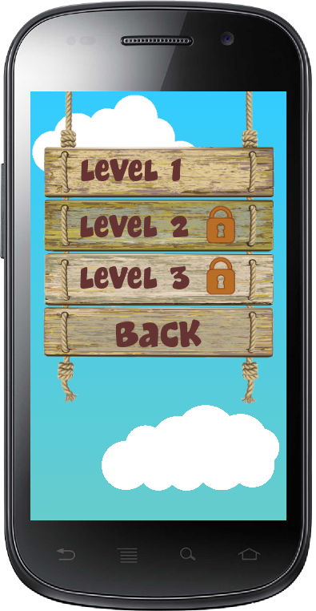
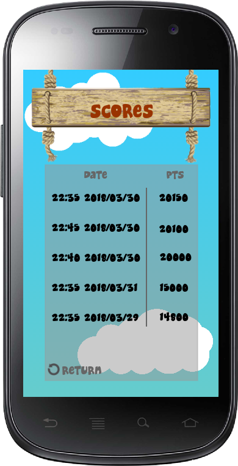
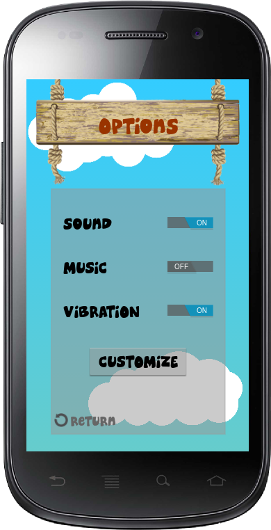

# LPOO1617_T3G02_P2
Project 2 for LPOO class

* **Team members**:
   * [Ana Claudia Fonseca Santos](https://github.com/anaezes) 
      * up200700742 (up200700742@fe.up.pt)
   * [Cristiana Maria Monteiro Ribeiro](https://github.com/311-311) 
      * up201305188 (up201305188@fe.up.pt)
      
      
# Final Project Intermediate Check-Point:

* **Architecture Design:**
  * UML

  
  

  
  * Sequences and state machines
      * Interaction sheme
      
       
  

       
       * Menu state
      
       
  

       
       * Game state
       
       
  

       
       * Level state
       
       
  

  
  * Expected Design Patterns:
    * Model-View-Controller (MVC)
    * Singleton
    * Factory
    * Fluent Builder
    * ...

* **GUI Design:**
  * Listing of the main functionalities, present on the GUI, and game description. 
    * Choose menu.
    * Choose the level
      - Each level has a different theme and to play them, with the exception of the first, you need to unlock them.
      - The weight of the chicken increases with the passing of the levels (Physics).
    * Play the game:
      - Touching the screen to make the chicken fly.
      - Rotating the screen to make the chicken to avoid obstacles or catch awards. 
    * Display game state.
    * Change game options.
    * Customize the chicken:
      - Choose another colors and items. 
  
  * GUI mock-up
  
    * Mock-up general:
    
    
  

    
    * Design of main screen:
    
    
  

    
    * Design of main menu:
    
    
  

    
    * Design of play menu:
    
    
  

    
    * Design of Game (level 1):
    
    
  

    
    * Design of the instructions:
    
    
  

    
    * Design of the scores:
    
    
  

    
    * Design of the options:
    
    
  
 
 
  
* **Test Design:**

  * Listing of the expected final test cases:
  
      * testMoveBird() - Bird moves on user input;
      
      * testScore() - Score change when bird moves;
      
      * testCollisionStone() - Collision with a stone object;
      
      * testCollisionBranch() - Collision with a branch object;
      
      * testWaterRising() - Tests if water is rising;
      
      * testGetStar() - Bird get a star: the score changes (+ 100 pts);
      
      * testGetApple() - Bird get a apple: the score changes (+ 50 pts);
      
      * testPassLevel() - Pass for next level (case the score is more than a defined value);
      
      * testWinGame() - Tests if the user win the game;
      
      * testLoseGame() - Tests if the user lose the game;
